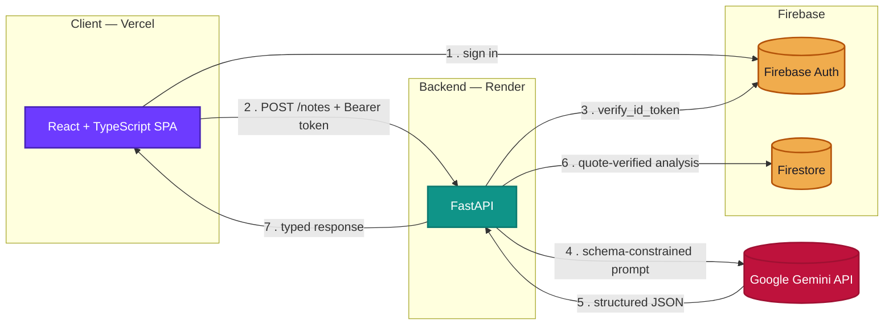
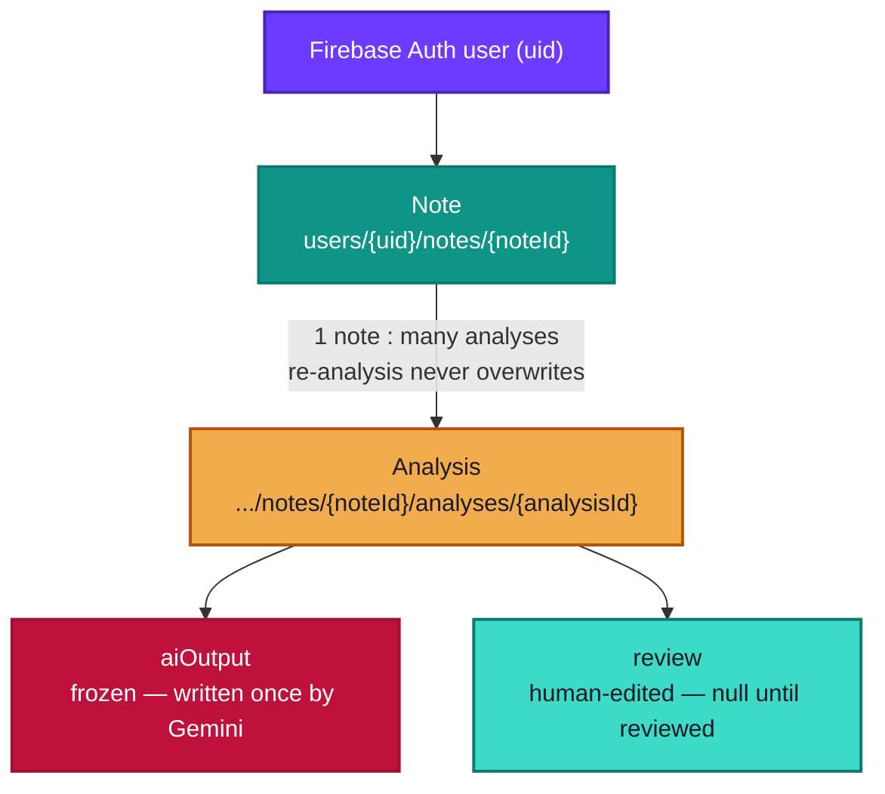

# Note Insight


**Paste a clinical note in, get a coder-ready structured analysis back in under a minute.**

**Live app: [note-insight.jmadhan.me](https://note-insight.jmadhan.me)** — sign up with any
email/password, or use the test account `note-insight-test@example.com` / `TestPass123!`.

Dr. Marina Ríos sees 20+ patients a day and writes a free-text note after each visit. Today
that note sits untouched for days before a coder reads it, queries her about what she meant,
and by then she's forgotten the patient. Note Insight closes that gap: it extracts conditions,
quotes the exact evidence for each one, flags documentation gaps, and suggests ICD-10 codes —
while the patient is still fresh in her mind, and with every AI claim checked against the
source text so it's never trusted blindly.

Built for the DoctusTech Junior Full-Stack / AI Engineer technical assessment. See
[PROJECT_PLAN.md](PROJECT_PLAN.md) for the phase-by-phase plan this repo followed.

---

## Contents

- [Quickstart](#quickstart)
- [Architecture](#architecture)
- [What it does](#what-it-does)
- [Data model](#data-model)
- [Design decisions](#design-decisions)
- [Testing](#testing)
- [What's left unfinished](#whats-left-unfinished)
- [Deployment](#deployment)
- [Project structure](#project-structure)
- [Prompt & sample notes](#prompt--sample-notes)
- [Time spent](#time-spent)

---

## Quickstart

Five things, in order, and you're running locally. No prior familiarity with this repo needed.

**You'll need:** Node.js 20+, Python 3.11+, a free [Firebase](https://console.firebase.google.com)
project, and a free [Gemini API key](https://aistudio.google.com/apikey). None of it costs
money — Firebase's Spark plan needs no card, and the Gemini free tier is enough for this.

### 1 · Firebase setup (~2 minutes)

In the [Firebase console](https://console.firebase.google.com): create a project → **Build →
Authentication → Get started → Email/Password → Enable** → **Build → Firestore Database →
Create database → Production mode**.

### 2 · Backend

```bash
cd backend
python -m venv .venv
source .venv/Scripts/activate      # Windows Git Bash; .venv\Scripts\activate on cmd/PowerShell
pip install -r requirements.txt

cp .env.example .env
# → paste your GEMINI_API_KEY into .env

# Firebase console → Project settings → Service accounts → Generate new private key
# → save the download as backend/serviceAccountKey.json (gitignored, never committed)

uvicorn app.main:app --reload --port 8000
```

Check `http://localhost:8000/health` → `{"status": "ok"}`. This works even before your Gemini
key or service account exist — see [design decision #5](#design-decisions) for why.

### 3 · Frontend

```bash
cd frontend
npm install

cp .env.example .env
# Firebase console → Project settings → General → Your apps → </> web icon → SDK config
# → paste the 6 values into .env

npm run dev
```

### 4 · Try it

Open `http://localhost:5173` → sign up with any email/password → paste one of the notes from
[`sample_notes/`](sample_notes/) → watch it come back structured in a few seconds.

### 5 · Run the tests (optional but satisfying)

```bash
cd backend && pytest -q
# 73 passed
```

---

## Architecture



The frontend never talks to Firestore or Gemini directly — every request goes through FastAPI,
which is the only thing holding the Gemini key and the only thing that verifies the Firebase ID
token before touching any data. Step 6 is where the quote-verification pass happens: Gemini's
response is validated against a Pydantic schema, then every `evidence_quote` is checked as a
literal substring of the original note before anything is stored.

---

## What it does

| | |
|---|---|
| **Schema-constrained AI output** | Gemini's `response_schema` returns a Pydantic-validated object directly — no regex, no hoping the model returned clean JSON |
| **Hallucination-checked evidence** | Every quoted excerpt is verified as a literal (normalized) substring of the note; a quote that doesn't match is flagged `unverified`, not silently dropped |
| **Human review, fully preserved** | Edit, reject, or add conditions — the original AI output is never overwritten, only shadowed by a separate `review` object |
| **Per-user data isolation** | Firestore paths are rooted at the caller's *verified* uid, not a client-supplied field — structurally enforced and tested, not just policed by convention |
| **Google + email/password auth** | Firebase Authentication, both providers wired and working |
| **Graceful failure, not silence** | A note is never lost — a failed analysis is stored with its error rather than the request just disappearing |
| **Explainable, not just labeled** | Every documentation-status flag comes with one specific sentence saying *why* — "type and control status are not stated," not just "ambiguous" |
| **Inline evidence highlighting** | Every verified quote is highlighted in place inside the original note, color-coded by documentation status, so re-reading the whole note isn't necessary to see what was flagged |
| **Correction metrics** | A dedicated view aggregating how often the AI's suggestions were kept, edited, rejected, or missed entirely — broken down per condition |
| **Per-user rate limiting** | Note submissions are capped per uid to prevent one user from burning through the Gemini quota |
| **Streaming analysis** | `POST /notes/stream` returns Server-Sent Events so the UI shows Gemini's output arriving live instead of a blank loading screen; falls back to the non-streaming path if the accumulated stream doesn't validate |
| **PDF / photo upload** | A photographed or scanned note (image or PDF) is transcribed to plain text via Gemini's multimodal input, then flows through the exact same validated pipeline as typed text |
| **Voice dictation** | The Web Speech API fills the note textarea from spoken input as an alternative to typing, live-transcribed with an interim preview |
| **Cross-visit recapture reminders** | Flags a chronic condition documented at a past visit for the same patient (matched by pseudonym) that's absent from today's note — the real "annual recapture" gap in CMS/HCC risk adjustment, not just a per-note check |
| **Identical-note caching** | A byte-identical resubmission skips the Gemini call entirely and returns the cached analysis — no repeat cost for the same note text |
| **73 automated tests** | Schema validation, quote verification, Gemini retry/failure/caching paths, cross-user isolation, rate limiting, metrics aggregation, and recapture-reminder matching, all covered |

---

## Data model



Firestore, chosen over Postgres/SQLite for three reasons: it needs no card on the free (Spark)
plan, it shares one credential/SDK surface with Firebase Auth (same project, same uid space),
and its collection-per-parent query model maps directly onto "all notes for user X, newest
first." The tradeoff is less flexible ad-hoc querying than SQL — a non-issue here, since every
query this product needs is "one user's notes" or "one note's analyses."

Four distinct entities, deliberately not collapsed into one document — the assessment's own
warning that doing so "will cause you problems by day three."

<details>
<summary><strong>Full reasoning: why subcollections, why two separate objects, who writes what</strong></summary>

**Why subcollections, not a flat "one analysis per note" document**: this directly answers the
assessment's own test question — "what happens when the same note is analyzed twice, e.g.
after you improve your prompt?" Each re-analysis is a new sibling document under the same
note. Nothing is overwritten and nothing disappears; the note's `latestAnalysisId` field just
points the UI at the newest one, while older analyses stay individually queryable (each
carries its own `promptVersion` and `modelVersion`, so a specific run is always attributable
to the prompt/model that produced it).

**Why `aiOutput` and `review` are two separate objects, not one mutable object with a
per-field "edited" flag**: the assessment calls the model-vs-human diff "the single most
valuable dataset the product will ever produce." That diff has to be reconstructable forever,
which means the original can never be overwritten in place — only shadowed by a second object.
`GET /notes/{id}/analyses/{id}` always returns both; the frontend shows the human-editable
version with per-condition badges (`AI` / `edited by you` / `added by you`) and keeps the raw
original visible in a collapsible panel.

**Which fields are written by which layer**:

| Field | Written by |
|---|---|
| `noteText`, `pseudonym`, `visitDate` | Human (the clinician, at submission) |
| `aiOutput` | Machine (Gemini, via the backend) — never touched again after creation |
| `review` | Human (the clinician, during review) |
| `quoteVerified` (per condition) | System — computed by the backend's substring-verification pass, not trusted from either the model or the client |
| `latestAnalysisId`, `latestConditionCount`, `latestReviewStatus` | System — denormalized onto the note doc by the backend whenever an analysis completes or is reviewed |
| `recaptureReminders` | System — computed at analysis time by querying this uid's other notes sharing the same `pseudonym`, diffing their latest documented conditions against this note's; never written by the model or the client |

**The query that matters — "all notes for user X, newest first"**: `users/{uid}/notes`
ordered by `createdAt desc`. Because it's a subcollection keyed by `{uid}`, and every read in
`backend/app/firestore_service.py` takes `uid` as its first argument sourced only from the
verified Firebase ID token (never from a client-supplied field — see `app/auth.py`), a request
authenticated as user A cannot reach user B's data by guessing a note or analysis id: the path
itself is rooted at the caller's own uid. This is checked structurally in
`backend/tests/test_firestore_isolation.py`, not just asserted in prose. It's a single-field
`order_by` with no additional filter, so it needs no composite index — Firestore's automatic
per-field index covers it. `condition_count` and `review_status` are denormalized onto the
note document (updated whenever an analysis completes or is reviewed) specifically so the
history list is one query, not an N+1 fetch into each note's `analyses` subcollection.

One clarification versus the plan in `PROJECT_PLAN.md`: Firestore is only ever touched
server-side, through the Admin SDK with a service account — the frontend talks to the FastAPI
backend, never to Firestore directly. That's necessary anyway since the Gemini key and the
orchestration logic have to live server-side. It means Firestore *security rules* aren't the
enforcement layer here (the Admin SDK bypasses them); the enforcement is the uid-scoped path
construction described above, gated by server-side ID token verification.

</details>

---

## Design decisions

<details open>
<summary><strong>1. Gemini's native <code>response_schema</code> instead of prompting for JSON and parsing it</strong></summary>
<br>

`google-genai`'s `GenerateContentConfig(response_mime_type="application/json",
response_schema=AIAnalysisOutput)` constrains the model's output at generation time and hands
back an object already validated against the Pydantic model (`response.parsed`). The
alternative — asking nicely for JSON in the prompt and regex/string-splitting the reply — is
exactly what the assessment says will be marked down, and in practice it's also just less
reliable. The cost is being tied to a Gemini SDK feature; if a second provider were added
later (Claude, GPT), the schema and the verification/retry logic in `gemini_service.py` would
carry over unchanged, only the API call itself would need a provider-specific adapter.
</details>

<details>
<summary><strong>2. Retry once on schema-invalid output, then fail explicitly rather than looping or guessing</strong></summary>
<br>

`run_analysis()` in `backend/app/gemini_service.py` gives the model one more attempt with an
explicit "your last response didn't match the schema" follow-up, then raises
`AnalysisFailure`. The alternative was either silently retrying indefinitely (masks a
systemic prompt problem behind latency) or failing on the first bad response (throws away a
cheap, often-successful second attempt). The route handler (`routers/notes.py`) then stores a
`status: "failed"` analysis with the error preserved, rather than losing the note — the
clinician's note is never dropped just because the model had a bad response.
</details>

<details>
<summary><strong>3. Normalized substring matching to verify evidence quotes, surfaced rather than hidden</strong></summary>
<br>

`verify_quote()` lowercases, collapses whitespace, and strips punctuation before checking that
a claimed quote is a literal substring of the note — tolerant of trivial formatting
differences, strict about actual content. A condition whose quote fails this check is not
discarded (that would silently hide a possibly-real finding); it's kept and flagged
`quote_verified: false`, shown in the UI as "unverified quote" so the clinician's attention
goes exactly where the model's claim is weakest. This is the concrete answer to "how do you
know the model didn't make this up?" — tested in `test_quote_verification.py` and
`test_gemini_service.py`, including a deliberate false-positive check (`"diabetes"` must not
match `"diabetic"`).
</details>

<details>
<summary><strong>4. Render over Fly.io/Railway/Cloud Run for the backend, despite the assessment listing all four</strong></summary>
<br>

Fly.io removed free allowances for new accounts in 2024, and Railway's "free" plan is now a
one-time $5 credit that expires in 30 days — neither is durable hosting. Cloud Run's
always-free quota (2M requests/month) is genuinely free and would avoid Render's cold-start
tradeoff entirely, but it requires a GCP billing account on file and the `gcloud` CLI logged
in locally; Render needs neither — connect the GitHub repo, done. That tradeoff (a 30–60s cold
start after 15 minutes idle vs. an extra account-verification step) is exactly the kind of
call the assessment says is the candidate's to make and justify — here, avoiding the billing
dependency won out. Paired with Vercel for the frontend for the same reason: no card, deploys
straight from the same GitHub repo.
</details>

<details>
<summary><strong>5. Lazy secret validation instead of required environment variables at startup</strong></summary>
<br>

`Settings.gemini_api_key` and the Firebase service-account path both default to empty/unset
rather than being required fields — `app/config.py` and `app/auth.py` only raise once a route
that actually needs the secret is called. This was a practical necessity while building ahead
of receiving real credentials (the app, `/health`, and 20+ tests all had to run without them),
but it also means a misconfigured deploy fails on `/notes`, not by refusing to boot at all —
worth knowing if `/health` ever looks fine while nothing else works.
</details>

<details>
<summary><strong>6. Firestore uses explicit service-account credentials, not <code>google.auth.default()</code></strong></summary>
<br>

`firestore.Client()` with no arguments relies on Application Default Credentials, which only
exist automatically on GCP infrastructure (or after `gcloud auth application-default login`
locally) — running it as-written against a real project surfaced this immediately as a
`DefaultCredentialsError`. `firestore_service.get_db()` now builds credentials explicitly from
the same service-account file already required for Firebase Admin
(`google.oauth2.service_account.Credentials.from_service_account_file(...)`), so there's one
secret to configure locally, not two, and no assumption that the app is running somewhere with
ADC pre-wired.
</details>

---

## Testing

```bash
cd backend
pytest -q
```

73 tests across 9 files, all passing, no live network calls (Gemini and Firestore are mocked):

| File | Covers |
|---|---|
| `test_schema_validation.py` | Pydantic rejects out-of-range confidence, invalid enum values, blank/oversized notes, empty `status_reason` |
| `test_quote_verification.py` | Real matches, false positives (`"diabetes"` ≠ `"diabetic"`), whitespace/punctuation tolerance |
| `test_gemini_service.py` | Retry-then-succeed, retry-then-fail, unverified-quote flagging on a real Gemini response shape |
| `test_firestore_isolation.py` | Every data-access path is structurally rooted at the caller's uid |
| `test_notes_router.py` | Full HTTP layer: auth requirement, 404 on cross-user access, failed analysis stored (not a 500), rate limiting, metrics route |
| `test_auth.py` | Firebase init failure surfaces as 503 (misconfigured), not an unhandled 500 |
| `test_rate_limit.py` | Per-user sliding window: allows up to the limit, blocks the next one, doesn't block a different user |
| `test_metrics.py` | Correction-rate aggregation by condition name, unreviewed analyses excluded, no division-by-zero with no data yet |
| `test_recapture.py` | Same-pseudonym matching, current-visit conditions excluded, rejected conditions ignored, no reminder when nothing is missing |

`test_gemini_service.py` also covers the cache directly: an identical resubmission skips the Gemini call (`generate_content.call_count == 1` across two calls to `run_analysis`), while a different note text always calls through.

Beyond the automated suite, the entire flow — signup, real Gemini analysis, edit/reject/add,
save, reload, history — has been run live against a real Firebase project and a real Gemini
key, not just against mocks.

---

## What's left unfinished

Left unfinished, deliberately, in favor of getting the core loop solid end to end:

- **No re-analysis flow in the UI.** The data model supports multiple analyses per note (see
  above) and the backend has no obstacle to a "re-analyze with the current prompt" button, but
  no route or UI exists for triggering it yet — a note can only be analyzed once from the
  current frontend.
- **No component-level frontend tests** — the backend has 73; the frontend has been verified by
  hand, live, repeatedly, but not with an automated suite. The highest-value addition here
  would be `AnalysisPage`'s review-diff logic (the `source: ai → human_edited` transition).
- **ICD-10 codes are exactly as approximate as the assessment says is acceptable** — no lookup
  against a real coding table, per the brief's explicit note that this isn't being evaluated.
- **Rate limiting and the identical-note cache are both in-memory, single-instance** — a
  documented, deliberate tradeoff (see `backend/app/rate_limit.py` and the `_analysis_cache`
  dict in `backend/app/gemini_service.py`), not an oversight. Both reset on redeploy and
  wouldn't be shared across multiple backend instances; a real production version would move
  both to Redis at the
  point this ever needed to scale horizontally, which a free-tier single-dyno deployment doesn't.

With one more week, in priority order: re-analysis UI, then frontend tests.

---

## Deployment

Backend on **Render**, frontend on **Vercel** — chosen over Cloud Run/Firebase Hosting
specifically to avoid needing a GCP billing account or the `gcloud` CLI; both platforms deploy
straight from the GitHub repo with no card and no local CLI login. The tradeoff is Render's
free tier sleeps after 15 minutes idle (30–60s cold start on the next request) — expected
behavior, not a bug, worth knowing if the app looks slow on a fresh check.

### Backend — Render

A `render.yaml` blueprint is at the repo root, so this is mostly point-and-click:

1. [render.com](https://render.com) → **New → Blueprint** → connect the `note_insight` GitHub
   repo. Render reads `render.yaml` and proposes the `note-insight-api` web service
   automatically (root dir `backend`, build/start commands already set).
2. Before the first deploy, set the two secret env vars it left blank:
   - `GEMINI_API_KEY` — your key
   - `CORS_ALLOW_ORIGINS` — the Vercel URL from the frontend step below (comma-separate if you
     also want `localhost:5173` for local testing against the deployed backend)
3. **Environment → Secret Files** → add a file named exactly `serviceAccountKey.json` (path
   `/etc/secrets/serviceAccountKey.json`, which is what `FIREBASE_SERVICE_ACCOUNT_PATH` in
   `render.yaml` already points at) → paste the contents of your local
   `backend/serviceAccountKey.json`.
4. Deploy. Note the resulting `https://note-insight-api-xxxx.onrender.com` URL — the frontend
   needs it next.

### Frontend — Vercel

The repo is a monorepo (`frontend/` and `backend/` as siblings), so Vercel needs to be told
where the frontend actually lives:

1. [vercel.com](https://vercel.com) → **Add New → Project** → import the `note_insight` repo.
2. **Root Directory** → set to `frontend` (Vercel then auto-detects the Vite framework preset;
   no `vercel.json` needed).
3. **Environment Variables** → add all 6 `VITE_FIREBASE_*` values from `frontend/.env.example`,
   plus `VITE_API_BASE_URL` set to the Render URL from step 4 above.
4. Deploy. Note the resulting `https://note-insight-xxxx.vercel.app` URL.
5. Go back to Render and update `CORS_ALLOW_ORIGINS` to this exact Vercel URL, then redeploy the
   backend (env var changes on Render require a redeploy to take effect) — until this matches,
   the deployed frontend's requests will be rejected by CORS even though everything else is
   correctly configured.

**Custom domain**: the live app is served from `note-insight.jmadhan.me` (a domain added on top
of the same Vercel project) rather than the raw `.vercel.app` URL. Pointing a custom domain at
an existing Firebase + Render deployment needs two more allowlists updated, both easy to miss
since neither shows an error until a real request hits them:

- **Firebase Console → Authentication → Settings → Authorized domains** — add the custom
  domain, or sign-in fails with `auth/unauthorized-domain`.
- **Render → `CORS_ALLOW_ORIGINS`** — add the custom domain to the comma-separated list
  alongside the `.vercel.app` origin, or every API call past sign-in fails CORS silently in
  the console while the page itself looks fine.

---

## Project structure

```
note_insight/
├── backend/                       FastAPI service
│   ├── app/
│   │   ├── main.py                 App entrypoint, CORS, route registration
│   │   ├── auth.py                 Firebase ID token verification (lazy-initialized)
│   │   ├── config.py                Env-based settings, secrets validated on first use
│   │   ├── models.py                Pydantic schemas — the AI output contract + API contract
│   │   ├── gemini_service.py        Schema-constrained Gemini calls, retry, quote verification
│   │   ├── firestore_service.py     uid-scoped data access layer + metrics aggregation
│   │   ├── rate_limit.py            Per-user, in-memory sliding-window limiter
│   │   ├── prompts/
│   │   │   └── note_analysis_prompt.py   The actual prompt sent to Gemini
│   │   └── routers/
│   │       ├── health.py            GET /health
│   │       └── notes.py             POST /notes, GET /notes, GET /notes/metrics, review endpoint
│   └── tests/                       73 tests: schema, quotes, retries, isolation, HTTP layer,
│                                     rate limiting, metrics, recapture reminders
├── frontend/                       React + TypeScript (Vite)
│   └── src/
│       ├── pages/                   LandingPage, AuthPage, NoteSubmitPage, AnalysisPage,
│       │                            HistoryPage, MetricsPage
│       ├── components/              AppShell (sidebar layout), hand-rolled icon set
│       ├── context/                 AuthContext — Firebase auth state
│       ├── api/                     Typed fetch client mirroring the backend contract
│       ├── utils/                   highlightNote.ts — inline evidence-quote highlighting
│       └── types/                   TypeScript types mirroring the Pydantic models
├── sample_notes/                   3 synthetic clinical notes to try the product with
├── render.yaml                     Render deploy blueprint (backend)
└── PROJECT_PLAN.md                 The phase-by-phase plan this repo followed
```

---

## Prompt & sample notes

The full prompt sent to Gemini lives in
[`backend/app/prompts/note_analysis_prompt.py`](backend/app/prompts/note_analysis_prompt.py),
versioned via `PROMPT_VERSION` and stored on every analysis document so old and new analyses
of the same note stay individually attributable to the prompt that produced them.

Three synthetic notes in [`sample_notes/`](sample_notes/) — no real patient data anywhere in
this repo:

| File | What it tests |
|---|---|
| `01_well_documented.txt` | Both conditions fully documented — the `well_documented` path |
| `02_ambiguous_underdocumented.txt` | Diabetes without type/control status, a medication with no stated diagnosis — the documentation-gap detection this product exists for |
| `03_minimal_edge_case.txt` | No clinical content at all — the empty-conditions path |

## Time spent

~30 hours.
